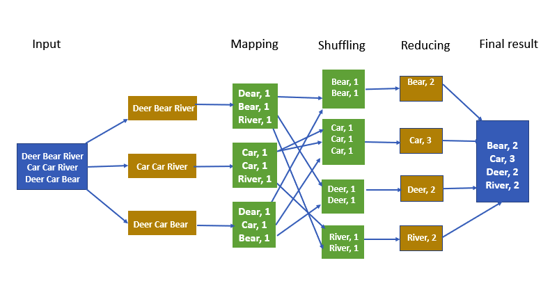
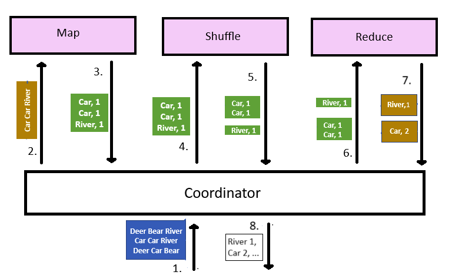

# MapReduce

This repository contains a simple implementation of the MapReduce model for word counting. This implementation was developed to explore and demonstrate the use of Docker and Kubernetes in a microservices context. Work is currently underway to integrate GitLab CI/CD and certain Ansible functionalities.

## MapReduce

MapReduce counts the frequency of each word in a document using multiple steps. Each of these steps can be implemented as a microservice where multiple workers can operate in parallel.



At the beginning, the input document is split into chunks. These chunks are sent to the map service.
- Map: the map service maps each word to the number "1" to indicate its occurrence.
- Shuffle: the occurrences are sent to the shuffle service, distributing them such that all occurrences of the same word are sent to the same worker. The shuffle service will group together all occurrences of the same word.
- Reduce: the groups are sent to reduce service, which sums the occurences of each word to obtain the frequency.

For more information about the MapReduce model, please refer to [1] and [2].

### The implementation

The implementation in this repository is made of 3 services: map, shuffle and reduce.



To process a document, the following steps are performed:
1. the coordinator receives the document
2. the coordinator splits the document and sends each chunk to the map service
3. the map service maps each word to the occurrence "1"
4. the coordinator sends the occurrences to the shuffle service
5. the shuffle service groups all occurrences of the same word together
6. the coordinator sends the groups to the reduce service
7. the reduce service sums the occurrences of each word
8. finally, the coordinator returns the count of each word

This implementation is a simplified version of the MapReduce model loosely inspired by [3]. The presence of a coordinator makes the design easier, but it also reduces the parallelism of the operation. For this reason, this project is probably not suitable for production environments: its purpose is mainly to learn and demonstrate the use of DevOps tools in a "real-life" problem.

## Usage

In order to use the service, apply the manifests from the repository:
```bash
>>> kubectl apply -f <path_to_this_repo>/deployments
```

Then, you can perform a POST request to the "coord" service providing the document in the body. For example, from your local workstation:
```bash
>>> kubectl proxy --port=8080 &
>>> curl -X POST http://127.0.0.1:8080/api/v1/namespaces/<coord_namespace>/services/coord/proxy -d "Row, row, row your boat, gently down the stream."
# Output:
{"boat":1,"down":1,"gently":1,"row":3,"stream":1,"the":1,"your":1}
```

## References

[1] https://en.wikipedia.org/wiki/MapReduce  
[2] https://medium.com/@tirthshah100/word-count-in-apache-hadoop-mapreduce-c6ee8e737fb9  
[3] https://medium.com/digitalwing/development-of-a-distributed-computing-system-based-on-mapreduce-and-kubernetes-837fc7f112f9  